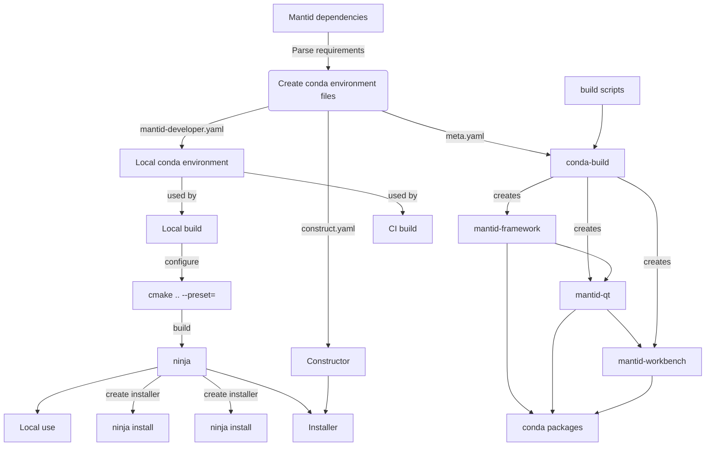
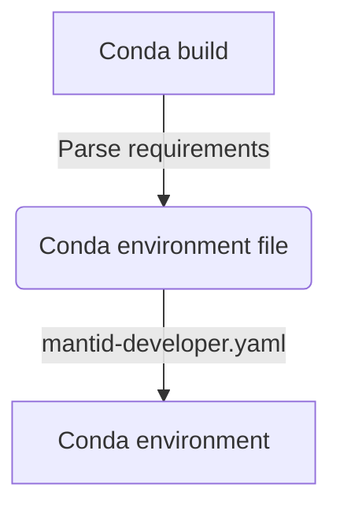

# Handover docs


# CMake

How find_package(MantidFramework) works. Relies on a config file in the mantid repository, which defines the contents of the MantidFramework package:


```cmake
# Defines the cmake targets for the Mantid framework.

@PACKAGE_INIT@

include(CMakeFindDependencyMacro)

find_dependency(Python @Python_VERSION_MAJOR@.@Python_VERSION_MINOR@ REQUIRED
             COMPONENTS Interpreter Development NumPy)
find_dependency(Boost COMPONENTS date_time regex serialization filesystem system python${Python_VERSION_MAJOR}${Python_VERSION_MINOR})
find_dependency(Poco COMPONENTS Foundation Util XML Net Crypto NetSSL)
find_dependency(GSL)
find_dependency(ZLIB)
find_dependency(HDF5)
find_dependency(OpenSSL)
find_dependency(OpenMP COMPONENTS CXX)
find_dependency(HDF5 COMPONENTS C CXX HL)
find_dependency(Eigen3)

set(_mypackage_module_path_save "${CMAKE_MODULE_PATH}")
list(INSERT CMAKE_MODULE_PATH 0 "${CMAKE_CURRENT_LIST_DIR}/find_modules")

# Using custom find modules
find_dependency(Nexus)
find_dependency(JsonCPP)
find_dependency(TBB)
find_dependency(MuParser)

set(CMAKE_MODULE_PATH "${_mypackage_module_path_save}")
unset(_mypackage_module_path_save)

set(MODULES
    Types
    Json
    Kernel
    Parallel
    HistogramData
    Indexing
    Beamline
    Geometry
    API
    NexusGeometry
    DataObjects
    Catalog
    Nexus
    PythonInterfaceCore
)

foreach(module ${MODULES})
include("${CMAKE_CURRENT_LIST_DIR}/Mantid${module}Targets.cmake")
check_required_components(Mantid${module}Targets)
list(APPEND MantidFramework_Libraries "Mantid::${module}")
endforeach()
```
Each module in the MODULES list defines an importable target, e.g Mantid::Kernel, or Mantid::Types. These importable targets are created when we install libraries, which requires CONDA_BUILD=True and leads to the following install call for the kernel:

```cmake
if(CONDA_BUILD)
  set(TARGET_EXPORT_NAME "MantidKernelTargets")
  mtd_install_framework_lib(TARGETS Kernel EXPORT_NAME ${TARGET_EXPORT_NAME})
endif()
```
The new mtd_install_framework_lib helper function does the following:


As well as the config and target files we also install our custom finders, e.g FindNexus, which ensures that the find_dependency macro will find don't have inbuilt find modules shipped with CMake.
 

A note on some conda CMake variables::
o
- 
- 


## Conda.


Conda provides a package manage to source our dependencies from. Environment files specify any package requirements we have. Our files follow a policy of specifying the minimum version of each package supported:


```yaml
dependencies:
  - muparser>=2.3.2
```

If a library suitably following semantic versioning we shouldn't expect any incompatible API changes between minor versions of the libraries. However, this is not always the case. To get a broad overview of changes in binaries between versions the abi-laboratory tool can be used, e.g for boost

https://abi-laboratory.pro/index.php?view=timeline&l=boost

## Conda forge
Uses conda smithy and conda build to create a package of your supplied source code. To submit a new package you fork the staged recipes repository.
https://github.com/conda-forge/staged-recipes

Next, for your package you create a folder in the recipes folder. To build a c++ package this folder will typically contain:

- A build.sh file for osx and linux building
- A build.bat file for windows
- A meta.yaml file specifying your required environment. 

The build scripts will typically contain make / cmake commands used to compile your project. E.g at is simplest level it could contain

```sh
mkdir build
cd build

cmake \
  ${CMAKE_ARGS} \
  -DCMAKE_BUILD_TYPE=Release \
  ..

ninja
ninja install
```

Note: CMAKE_ARGS is used on linux and osx to supply common arguments to all conda-forge packages, e.g install directory and openmp flags amongst others.

The meta.yaml file is used to provide conda-build the build, host and runtime requirements. For example, consider the requirements for mantid-framework,
```yaml

requirements:
  build:
    - {{ compiler("c") }}
    - {{ compiler("cxx") }}
    - llvm-openmp  # [osx]
    - libgomp  # [linux]
    - ninja  # [unix]
    - cmake
    - {{ cdt('mesa-libgl-devel') }}  # [linux]
    - {{ cdt('mesa-dri-drivers') }}  # [linux]
    - {{ cdt('libxxf86vm') }}  # [linux]
    - {{ cdt('libx11-devel') }}  # [linux]
    - {{ cdt('xorg-x11-proto-devel') }}  # [linux]
  host:
    - boost {{ boost }}
    - eigen
    - gsl<=2.6
    - h5py
    - hdf5=1.10.*
    - jemalloc  # [unix]
    - jsoncpp
    - librdkafka
    - lib3mf
    - muparser
    - nexus
    - numpy {{ numpy }}
    - occt
    - python {{ python }}
    - poco
    - tbb-devel=2020.2.*
    - zlib
    - pip
  run:
    - {{ pin_compatible("boost", max_pin="x.x") }}
    - {{ pin_compatible("gsl", max_pin="x.x") }}
    - h5py
    - lib3mf 
    - matplotlib-base
    - nexus
    - {{ pin_compatible("numpy", max_pin="x.x") }}
    - occt
    - python
    - python-dateutil
    - pyyaml
    - scipy

```
Separating out the build and host requirements allows cross compilation where host specifies your target system for package (i.e the system which the dependencies need to have been compiled for) whereas the build environment typically contains just the build tools, e.g the compiler and CMake. 

The runtime requirements are needed as some build or host requirements section will impose a runtime requirement. Most commonly this is true for shared libraries (boost), which are required for linking at build time, and for resolving the link at run time.

To ensure we get compataible runtime, we can use pinning expressions in the runtime dependencies:
```yaml
- {{ pin_compatible("gsl", max_pin="x.x") }}
```
With this example, if we built with gsl version 1.6.1 this pinning expression would evaluate to gsl>=1.6.1,<1.7.

Another way to include runtime dependencies is to define a run_exports section in the recipe, for example jsoncpp includes in its meta.yaml:,
```yaml

build:
  number: 3
  run_exports:
    - {{ pin_subpackage('jsoncpp', max_pin='x.x.x') }}
```
This means if we include jsoncpp in our host requirements section, as with mantid, it will automatically be added to our runtime dependencies. This was developed to avoid people forgetting to include runtime dependencies in their package. THis example means if we built with jsoncpp 1.8.1 we would accept the following versions at runtime jsoncpp>=1.8.1,<1.8.2

This is very strict pinning, the reason for this can be seen by looking at the abi-laboratory entry for jsoncpp: 
https://abi-laboratory.pro/index.php?view=timeline&l=jsoncpp

Which shows some abi change between patch versions.


Alongside these requirements, sits several other required fields, these include:

- test:
    - Things in this section are run after the package has been built to test it is complete, e.g python imports. If a test fails the package is marked as broken.
- source:
    - Defines where to source the pacakge code from, e.g through a github link to a tar containing the source code - usually specified using a github tag.
- extra:
    - Package maintainers
- about
    - Package information and license. 

Examples of the above fields are shown below:

```yaml
test:
  imports:
    - mantid.kernel
    - mantid.geometry
    - mantid.api
    - mantid.simpleapi

build:
  number: 0
  run_exports:
    - {{ pin_subpackage('mantid-framework', max_pin='x.x.x') }}
```


# Diagrams


# From dependencies to conda environments
From our initial list of mantid dependencies we can extract our conda depenendices and source approairate versions from conda forge. These dependnecies are consumed in three ways: (1) By our local environment files, used to build mantid (2) By the conda-build meta.yaml file used to speicify our build, host and runtime requirements of our mantid package. And lastly, when creating an installer we create a construct.yamlf file, which defines our python dependencies. 


# Conda build (nightly and release)



# Standalone installer (WIP)
