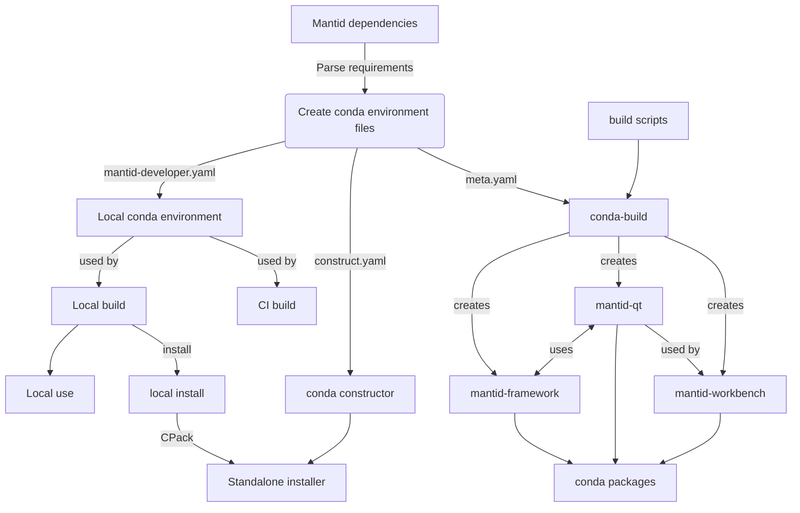
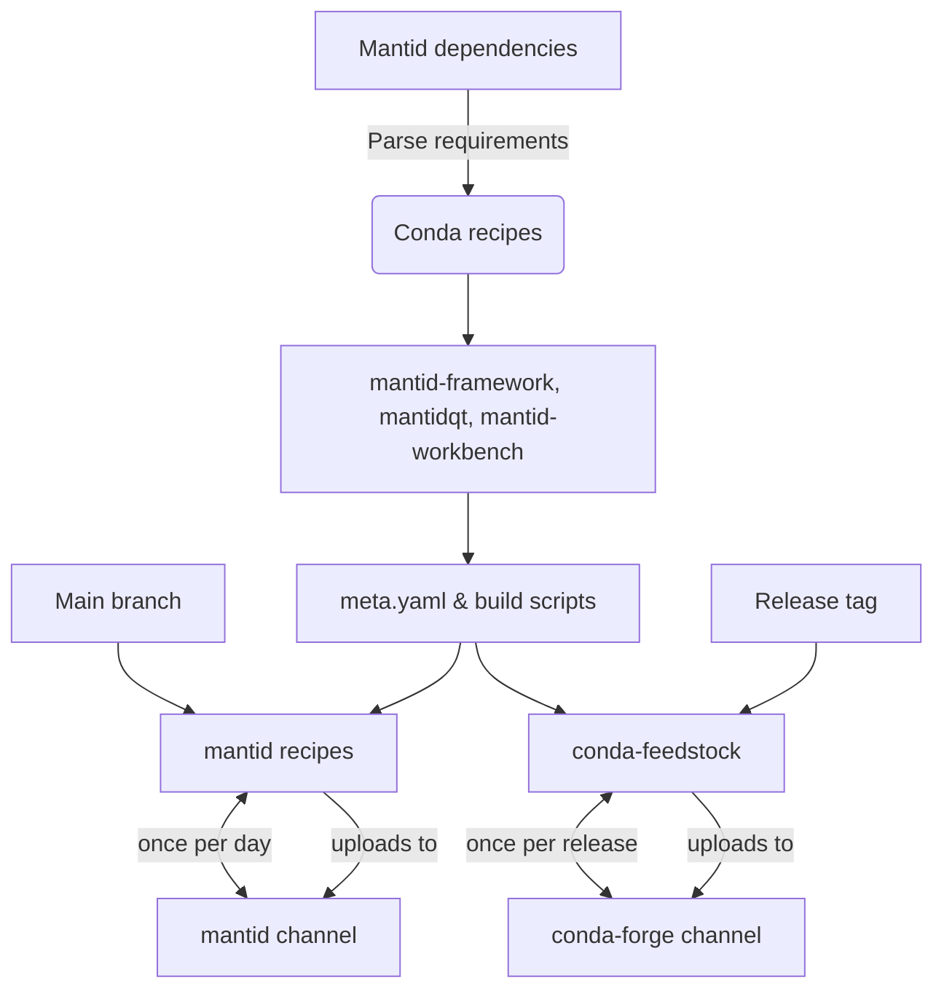
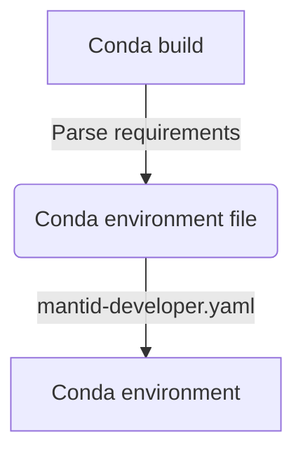

# Diagrams

# From dependencies to conda environments
From our initial list of mantid dependencies, we can extract our conda depenendices and source approairate versions from conda forge. These dependnecies are consumed in three ways: (1) By our local environment files used to build mantid (2) By the conda-build meta.yaml file used to speicify our build, host and runtime requirements of our mantid package. And lastly, when creating an installer we create a construct.yamlf file, which defines our python dependencies. 

  # Conda build (nightly and release)

# Standalone installer (WIP)

