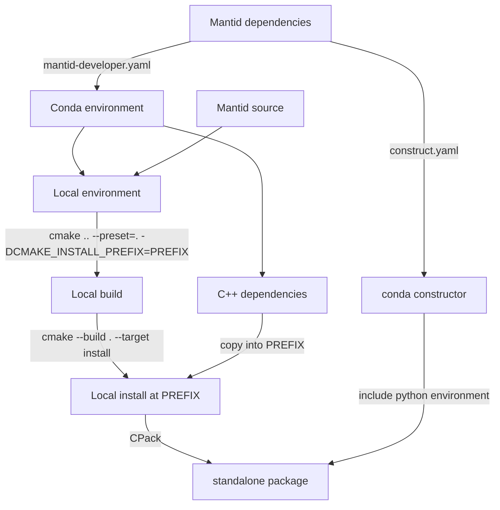

# Standalone installer (WIP)

An example project is available here https://github.com/StephenSmith25/mantid-package-example

It roughly follows the diagram below:



# Steps of packaging a c++ project (with CMake)

- Configure cmake and specify and install directory
```
-cmake .. -DCMAKE_INSTALL_PREFIX=PREFIX
```
- build
```
ninja 
```
- Install
```
ninja install
```
To make the install standalone we need top copy in the c++ dependencies. We have several choices of what we can use to copy these dependenices in:

- Use a seperate script which is run by CMake which analyses the dependencies of binaries using otool or another dependency viewer.
- Use the built in CMake functionality `GET_RUNTIME_DEPENDENCIES`
```
file(GET_RUNTIME_DEPENDENCIES
  [RESOLVED_DEPENDENCIES_VAR <deps_var>]
  [UNRESOLVED_DEPENDENCIES_VAR <unresolved_deps_var>]
  [CONFLICTING_DEPENDENCIES_PREFIX <conflicting_deps_prefix>]
  [EXECUTABLES [<executable_files>...]]
  [LIBRARIES [<library_files>...]]
  [MODULES [<module_files>...]]
  )
```
Which can be used to obtain the dependencies of input MODULES, LIBRARIES and EXECUTABLES. This will however miss certian libraries which are loaded at runtime (e.g qt platform plugins). To manually copy these binaries in we define our own macro:
```
macro(install_qt5_plugin _qt_plugin_name _qt_plugins_var _prefix)
  get_target_property(_qt_plugin_path "${_qt_plugin_name}" LOCATION)
  if(EXISTS "${_qt_plugin_path}")
    get_filename_component(_qt_plugin_file "${_qt_plugin_path}" NAME)
    get_filename_component(_qt_plugin_type "${_qt_plugin_path}" PATH)
    get_filename_component(_qt_plugin_type "${_qt_plugin_type}" NAME)
    set(_qt_plugin_dest "${_prefix}/PlugIns/${_qt_plugin_type}")
    if (APPLE)
    install(FILES "${_qt_plugin_path}" DESTINATION "${_qt_plugin_dest}" COMPONENT Runtime)
    set(${_qt_plugins_var}
    "${${_qt_plugins_var}};\$ENV{DEST_DIR}\${CMAKE_INSTALL_PREFIX}/${_qt_plugin_dest}/${_qt_plugin_file}"
     )
    else()
    install(FILES "${_qt_plugin_path}" DESTINATION "${_prefix}/bin/${_qt_plugin_type}" COMPONENT Runtime)
    set(${_qt_plugins_var}
    "${${_qt_plugins_var}};\$ENV{DEST_DIR}\${CMAKE_INSTALL_PREFIX}/bin/${_qt_plugin_type}/${_qt_plugin_file}"
    )
    endif()
  else()
    message(FATAL_ERROR "QT plugin ${_qt_plugin_name} not found")
  endif()
endmacro()
```
and call it with:
```
if (APPLE)
install_qt5_plugin("Qt5::QCocoaIntegrationPlugin" QT_PLUGINS ${prefix})
elseif(WIN32)
install_qt5_plugin_a("Qt5::QWindowsIntegrationPlugin" QT_PLUGINS ${prefix})
endif
```
Paraview does a similar thing. 

- Alternatively we can use the bundle utilities CMake helper:
```
if (APPLE)
install_qt5_plugin("Qt5::QCocoaIntegrationPlugin" QT_PLUGINS ${prefix})
elseif(WIN32)
install_qt5_plugin_a("Qt5::QWindowsIntegrationPlugin" QT_PLUGINS ${prefix})
endif
set(APPS "\${CMAKE_INSTALL_PREFIX}/bin/MY_EXECUTABLE")
# Call bundle utilities
install(CODE "
include(BundleUtilities)
set(BU_CHMOD_BUNDLE_ITEMS ON)
fixup_bundle(\"${APPS}\" \"${QT_PLUGINS}\" \"${DIRS}\")
" COMPONENT Runtime)
```
NOTE: All of these commands have to within an `install(...)` call, else they'd be executed at configure time.

- CMake > 3.21 includes a new feature to automatically install runtime dependencies of a target. Maybe this can help:

```
install(TARGETS targets...
        [RUNTIME_DEPENDENCIES args...|RUNTIME_DEPENDENCY_SET <set-name>]
)
```


Once we have copied the libraries into our install we need to modify the binary and shared library rpaths. We can do this by setting an install rpath on the binary / shared libraries:
```
if(${CMAKE_SYSTEM_NAME} MATCHES "Darwin")
  set_target_properties(TargetName PROPERTIES INSTALL_RPATH
                                              "@loader_path/../Frameworks")
elseif(${CMAKE_SYSTEM_NAME} STREQUAL "Linux")
  set_target_properties(TargetName PROPERTIES INSTALL_RPATH
                                              "\$ORIGIN/../lib")
endif()
```
This ensures executables can find their dependencies, which are typically located in Frameworks and lib folders on Mac and Linux respectively. 

On windows we copy all the runtime components into the bin folder, so they can find each-other and runtime.

# Steps in packaging a c++ project with python
To include python, we have two choices

1) Copy the python files into our package
2) Use conda constructor to include our python dependencies.

Previously, we used to do (1) in Mantid. However with conda this will not be possible, as the python executable is not standalone (i.e. it needs a conda environment) To get round this, we can include the python environment using conda constructor. This program creates a conda environment installer which we can install quietly while we are installing mantid. This will cause a nested conda environment to be present in the mantid install. This environment can then be activated using appropriate scripts. Conda constructor works on all platforms we intend to support. 